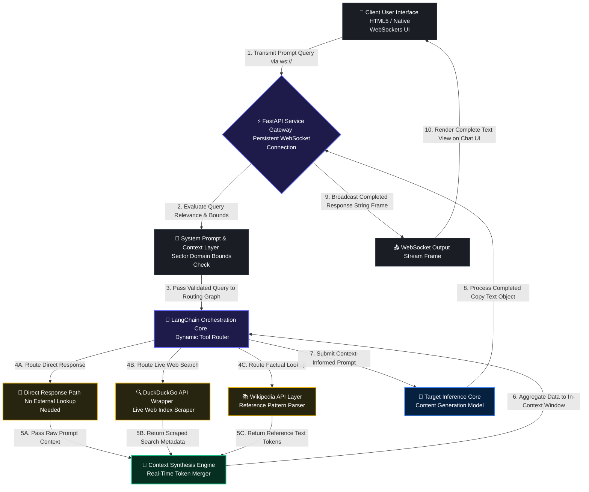

# 🤖 Autonomous Agentic AI Copywriter & Market Research Engine

An enterprise-grade, domain-constrained Agentic AI application engineered to automate market research, trend analysis, and multi-channel content generation specifically for the Facilities Services and Maintenance sector. Powered by LangChain, the core engine leverages dynamic tool-calling layers to crawl the web via live engines, synthesize industry insights, and compile structured marketing copy over real-time persistent streaming pathways.

---

### 📐 Architectural Parameters & Scope
* **Role:** Lead AI Solutions Developer & Knowledge Engineer
* **Core Framework:** LangChain (Tool Selection, Token Packaging, & Context Assembly)
* **Agentic Tools:** DuckDuckGo Search Component + Wikipedia Reference API Parser
* **State Delivery Engine:** Stateless Full-Duplex WebSockets (`ws://`) via FastAPI
* **Domain Guardrails:** In-context System Prompt Instruction Matrices optimized strictly for corporate Facilities Management (B2B Commercial Cleaning, MEP Engineering, Property Maintenance).

---

### System Data-Flow & Tool-Orchestration Architecture

The system uses a highly responsive, decoupled layout. The frontend UI establishes a persistent WebSocket connection to the FastAPI gateway, which initializes an autonomous LangChain execution loop. The agent evaluates query bounds, pulls contextual web insights, and streams the compiled copy text object back to the client view without HTTP header parsing overhead.



---

### Key Technical Indicators & Engineering Implementations

* **System-Prompt Directed Alignment Matrix:** The application utilizes highly optimized, domain-specific system prompt instruction matrices via LangChain. This ensures the agent focuses its token generation windows and contextual web-search queries strictly on the Facilities Services and Maintenance sector—maximizing research accuracy for B2B engineering platforms without needing heavy, hardcoded programmatic routing code.
* **Autonomous Multi-Tool Orchestration:** Implements dynamic query analysis via LangChain. The engine intelligently judges when to query the live web index via DuckDuckGo for trending facilities problems, parse historical definitions on Wikipedia, or respond instantly using pre-trained model weights if no external lookup is required.
* **Persistent Full-Stack Architecture:** Exposes low-latency, bidirectional WebSocket endpoints (`/chat`) via FastAPI to handle user requests from an optimized HTML5/jQuery interface. This architecture prevents connection time-outs during complex multi-tool execution cycles by keeping a persistent socket handshake alive.
* **Dynamic Grounding & Citation Attribution Matrix:** To combat large language model hallucination and ensure factual traceability, the backend agent parses metadata tokens from search arrays to append live source citation URLs directly onto generated marketing assets. The system architecture is built to recognize and account for raw web citation decay (unstable or non-existent external third-party links), isolating citation text objects to preserve system stability and maintain factual data pedigree without breaking frontend token delivery.

---

### 📂 Repository File System Directory Layout

```text
├── .env.template          # Global API key configuration blueprint
├── requirements.txt       # Version-locked environment dependencies
├── main.py                # Primary FastAPI gateway execution entrypoint (Websocket Server)
├── Dockerfile             # Container configuration tailored for Hugging Face Spaces
└── app/
    ├── frontend/          # Frontend Web Layer (HTML5 User Interface, CSS, jQuery)
    │   └── index.html     # WebSocket Client Dashboard Terminal
    ├── prompts.py         # 📝 Domain-specific system prompt arrays for Facilities Management
    ├── tools.py           # LangChain custom DuckDuckGo and Wikipedia lookup components
    └── agent.py           # Core agent tool selection and routing graph logic
```

---

### 🚀 Local Quick-Start Workspace Execution

#### 1. Clone and Navigate to Infrastructure Workspace
```bash
git clone https://github.com
cd agentic-ai-copywriter
```

#### 2. Establish Environment File Configuration
```bash
cp .env.template .env
```
*Open the `.env` file and populate your secure LLM infrastructure provider tokens.*

#### 3. Start the Application Gateway
```bash
python main.py
```
*Navigate to your local address to interact with the responsive B2B copywriter terminal.*
