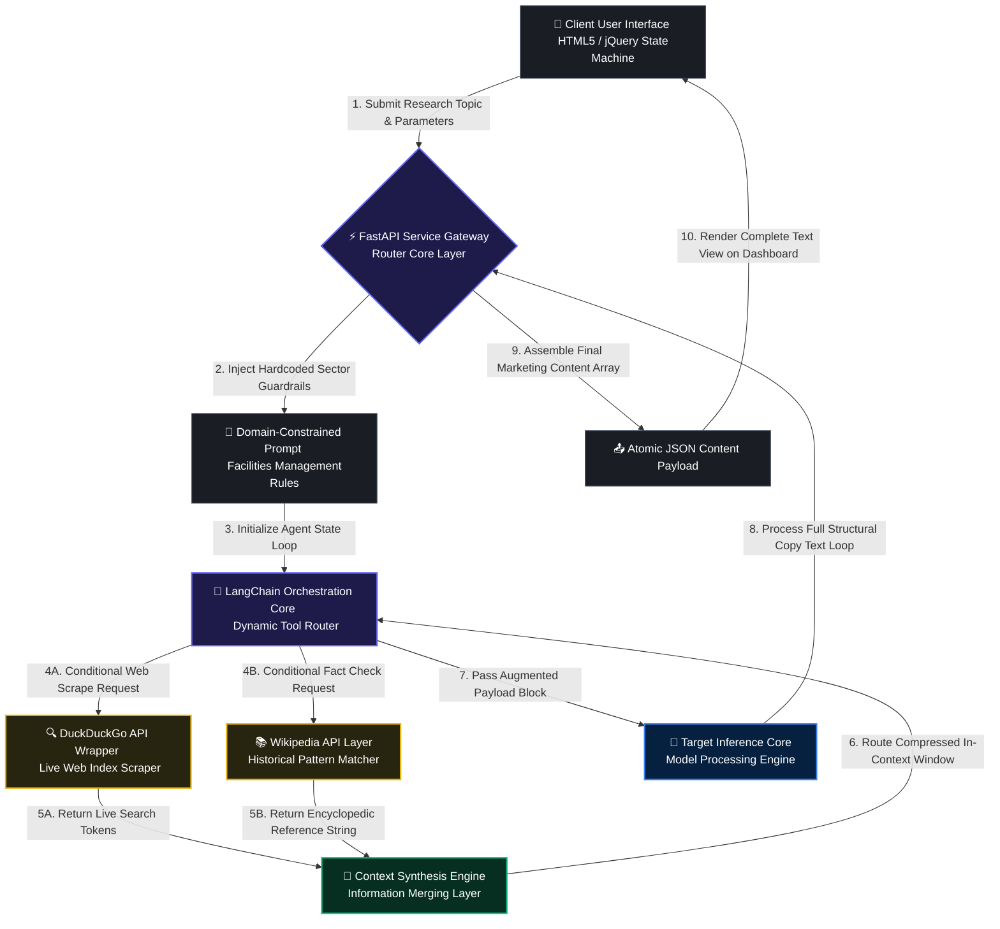

# 🤖 Autonomous Agentic AI Copywriter & Market Research Engine

An enterprise-grade, domain-constrained Agentic AI application engineered to automate market research, trend analysis, and multi-channel content generation specifically for the Facilities Services and Maintenance sector. Powered by LangChain, the core engine leverages dynamic tool-calling layers to crawl the web, synthesize live industry insights, and compile structured marketing blueprints without human data-entry overhead.

---

### 📐 Architectural Parameters & Scope
* **Role:** Lead AI Solutions Developer & Knowledge Engineer
* **Core Framework:** LangChain (Tool Calling, Routing, & Context Assemblers)
* **Agentic Tools:** DuckDuckGo Search API Component + Wikipedia Search Parser
* **Domain Guardrails:** Hard-coded prompt templates optimized strictly for corporate Facilities Management (B2B Commercial Cleaning, MEP Engineering, Property Maintenance).

---

### 🗺️ System Data-Flow & Tool-Orchestration Architecture

The system uses a decoupled layout. The frontend UI transmits target search boundaries to a FastAPI gateway, which initializes an autonomous LangChain execution loop to pull live web insights, process context in memory, and deliver a completed data block in a single HTTP POST request.



---

### 🚀 Key Technical Indicators & Engineering Implementations

* **Domain-Constrained Prompt Engineering:** The LLM's system state machine is strictly locked down using custom prompt templates. The agent rejects requests outside the Facilities Services matrix, guaranteeing highly professional text generation tailored specifically for B2B engineering platforms.
* **Autonomous Multi-Tool Orchestration:** Implements dynamic query analysis via LangChain. The engine intelligently judges when to query the live web index via DuckDuckGo for trending facilities problems or parse Wikipedia for operational standards definitions.
* **Decoupled Full-Stack Architecture:** Exposes non-blocking REST endpoints via FastAPI to receive web parameters from an optimized HTML5/jQuery interface, delivering structured text arrays in a single, stable atomic payload.

---

### 📂 Repository File System Directory Layout

```text
├── .env.template          # Global API key configuration blueprint
├── requirements.txt       # Version-locked environment dependencies
├── main.py                # Primary FastAPI gateway execution entrypoint
├── app/
│   ├── static/            # Frontend Web Layer (HTML5, Custom CSS, jQuery App Scripts)
│   ├── prompts.py         # 📝 Domain-specific system templates for Facilities Management
│   ├── tools.py           # LangChain custom DuckDuckGo and Wikipedia lookup scripts
│   └── agent.py           # Core agent routing execution graph logic
```

---

### 🚀 Local Quick-Start Workspace Execution

#### 1. Clone and Navigate to Infrastructure Workspace
```bash
git clone https://github.com
cd agentic-ai-copywriter
```

#### 2. Establish Environment File Configuration
```bash
cp .env.template .env
```
*Open `.env` and populate your target LLM model API tokens.*

#### 3. Start the Global Application Gateway
```bash
python main.py
```
*Open your local web browser to access the interactive full-stack market research dashboard dashboard.*
